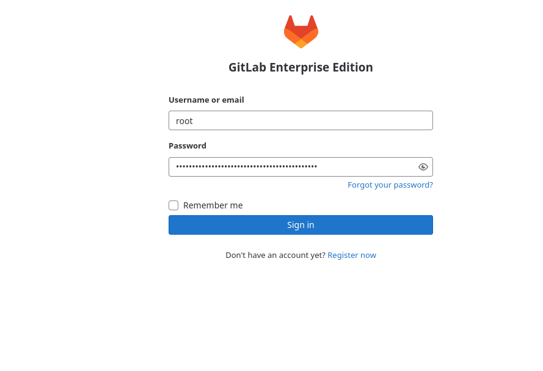
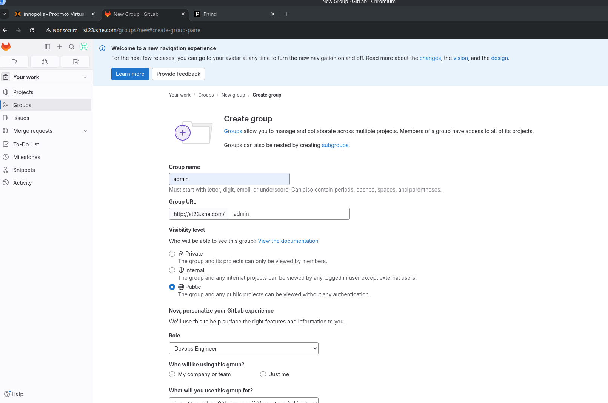
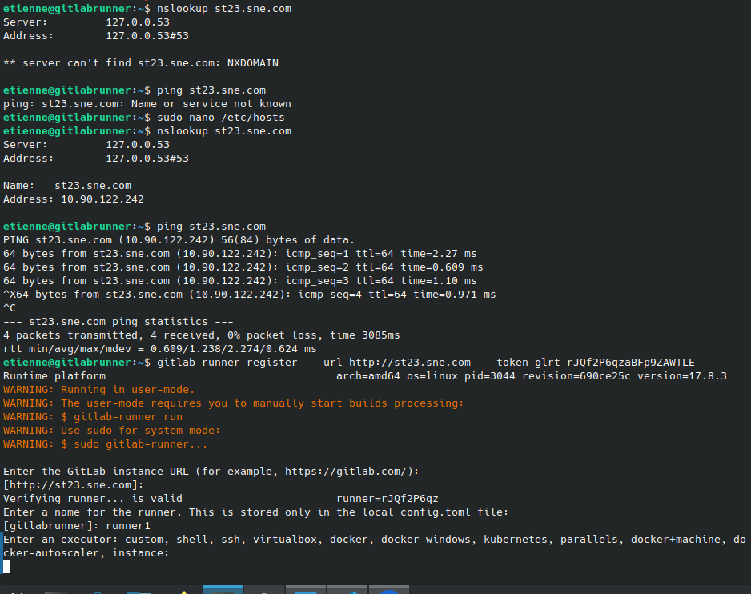
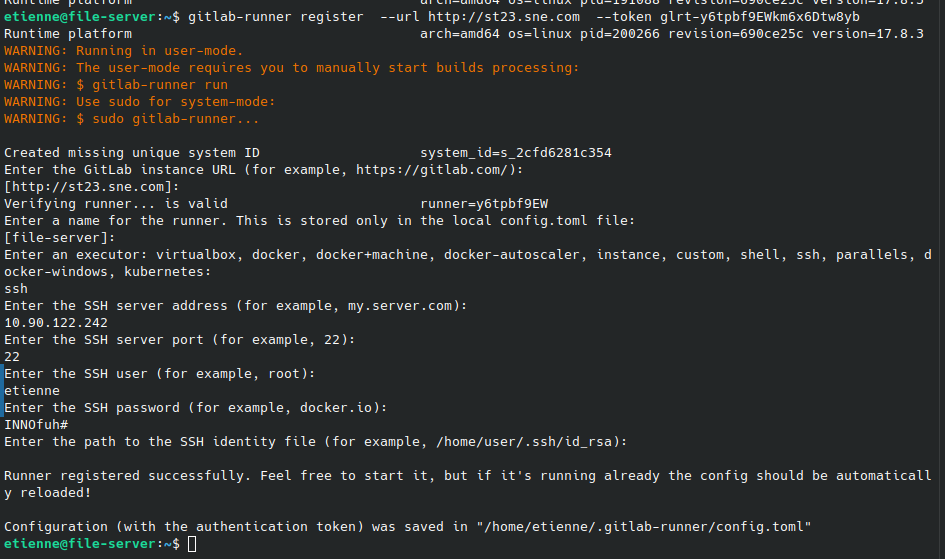
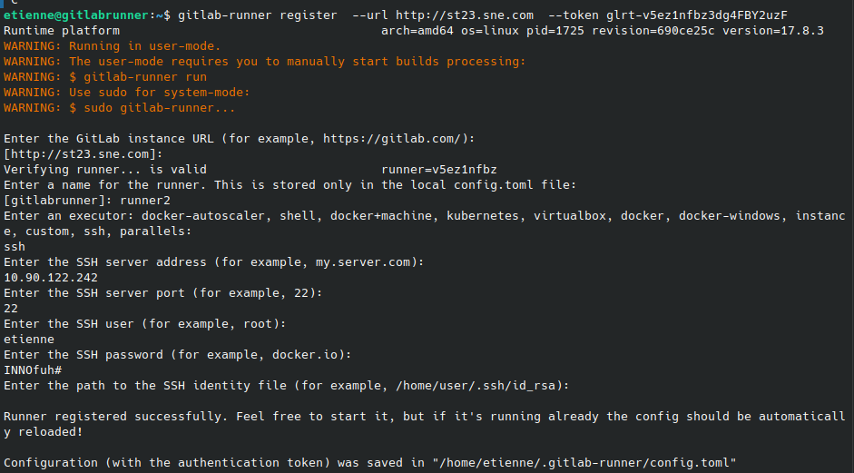
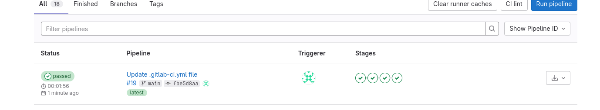
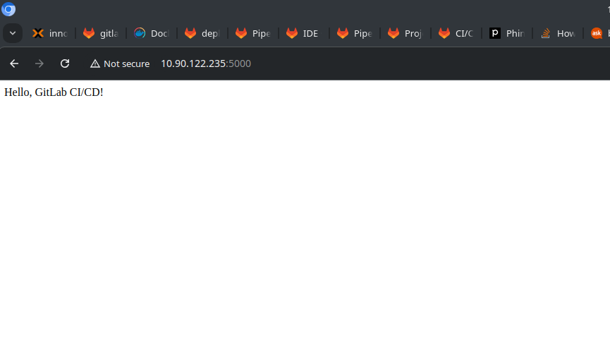

docker exec -it CONTAINER_ID cat /etc/gitlab/initial_root_password

sudo docker-compose -f 'docker-compose.yml' up -d --build 

sudo gitlab-ctl reconfigure
sudo gitlab-ctl restart

sudo curl -L --output /usr/local/bin/gitlab-runner https://gitlab-runner-downloads.s3.amazonaws.com/latest/binaries/gitlab-runner-linux-amd64
sudo chmod +x /usr/local/bin/gitlab-runner
sudo useradd --comment 'GitLab Runner' --create-home --shell /bin/bash gitlab-runner
sudo gitlab-runner install --user=gitlab-runner --working-directory=/home/gitlab-runner
sudo gitlab-runner start

# Stop the runner if it's running
sudo gitlab-runner stop

# Uninstall GitLab Runner
sudo gitlab-runner uninstall
sudo rm -rf /usr/local/bin/gitlab-runner

# Download the latest correct version
sudo curl -L --output /usr/local/bin/gitlab-runner https://gitlab-runner-downloads.s3.amazonaws.com/latest/binaries/gitlab-runner-linux-amd64

# Set permissions and install
sudo chmod +x /usr/local/bin/gitlab-runner
sudo gitlab-runner install --user=gitlab-runner --working-directory=/home/gitlab-runner
sudo gitlab-runner start

pip3 freeze > requirements.txt

