- Utiliser BusyBox	
kubectl run busybox --image=busybox --restart=Never -- sleep 3600 puis kubectl exec -it busybox -- ping my-nginx-service

- Installer ping dans Nginx
kubectl exec -it my-nginx -- sh puis apt update && apt install -y iputils-ping

- Tester DNS avec nslookup	
kubectl exec -it my-nginx -- sh puis nslookup my-nginx-service

- Tester HTTP avec curl	
kubectl exec -it my-nginx -- curl -I http://my-nginx-service

- create a deployment 
kubectl create deployment nginx --image=nginx

deployment.apps/nginx created

curl http://$(minikube ip):30080

kubectl scale deployment nginx-deployment --replicas=3

kubectl rollout undo deployment nginx-deployment

 kubectl rollout history deployment nginx-deployment

 kubectl get rs -l app=nginx-app

 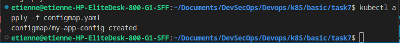
 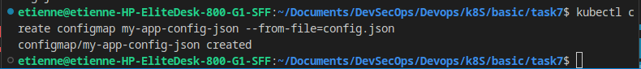
 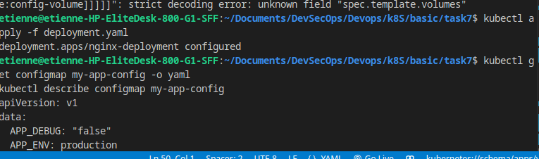
 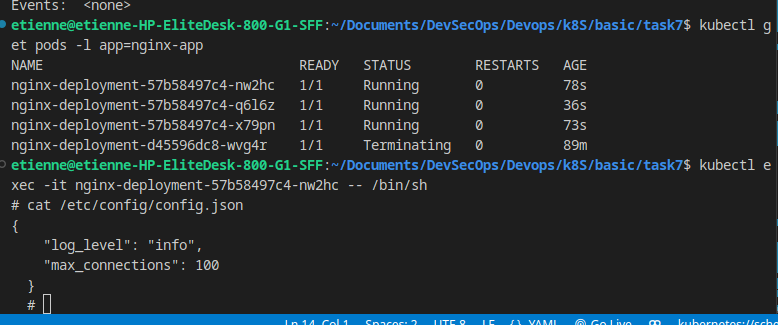
 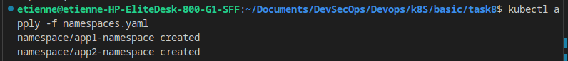
 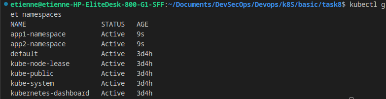
 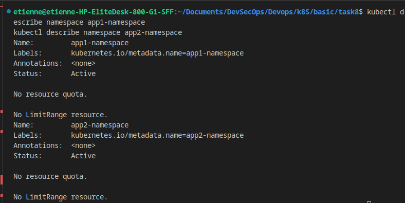
 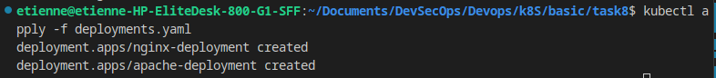
 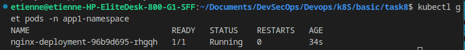
 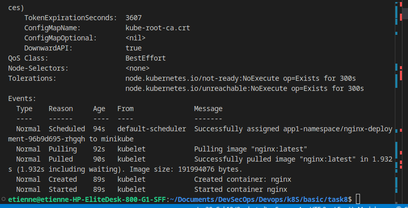
 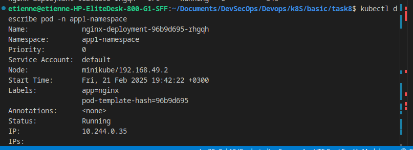
 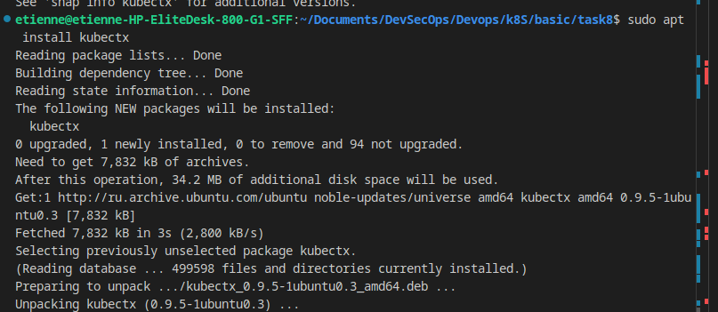
 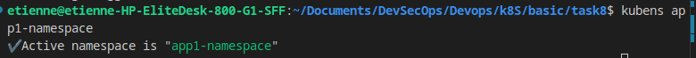
 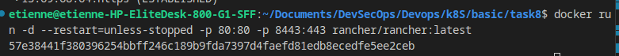