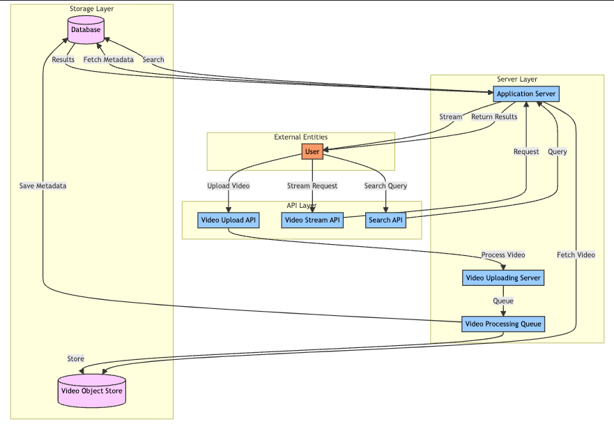
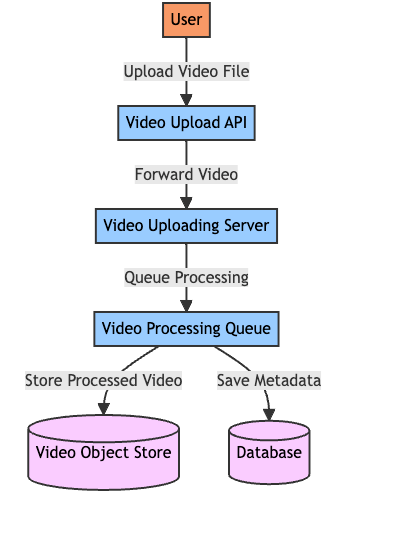
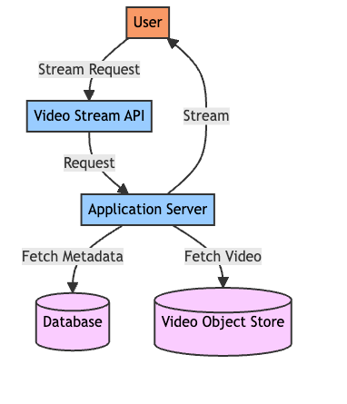
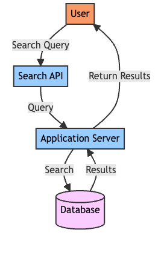

**Threat Modeling for a YouTube-like Application**

---

### **1. Decompose the Application**

#### **1.1 Entry Points**

Entry points are interfaces through which potential attackers can interact with the application. Below is a table listing the entry points for the YouTube-like application:

| **Entry Point**         | **Description**                                               |
| ----------------------------- | ------------------------------------------------------------------- |
| **User Authentication** | Login and registration forms for users.                             |
| **Video Upload API**    | API endpoint for uploading videos.                                  |
| **Video Stream API**    | API endpoint for streaming videos.                                  |
| **Search API**          | API endpoint for searching and filtering videos.                    |
| **User Profile API**    | API endpoint for displaying user profiles and uploaded videos.      |
| **Comment API**         | API endpoint for creating, displaying, and deleting comments.       |
| **Video Deletion API**  | API endpoint for deleting videos.                                   |
| **View History API**    | API endpoint for displaying user view history.                      |
| **Admin Dashboard**     | Interface for administrators to manage users, videos, and comments. |

---

#### **1.2 Assets**

Assets are the resources or data that attackers might target. Below is a table listing the assets for the application:

| **Asset**               | **Description**                                      |
| ----------------------------- | ---------------------------------------------------------- |
| **User Credentials**    | Usernames, passwords, and authentication tokens.           |
| **User Data**           | Personal information (e.g., email, name, profile picture). |
| **User Upload History** | List of videos uploaded by a user.                         |
| **User View History**   | List of videos watched by a user.                          |
| **Video Data**          | Metadata about videos (e.g., title, description, tags).    |
| **Video Objects**       | Actual video files stored in the object store.             |
| **Comments**            | User comments on videos.                                   |
| **System Availability** | Uptime and availability of the application.                |

---

#### **1.3 Trust Levels**

Trust levels define the access rights granted to external entities. Below is a table listing the trust levels:

| **Trust Level**         | **Description**                                                         |
| ----------------------------- | ----------------------------------------------------------------------------- |
| **Public Users**        | Unauthenticated users who can view public videos and comments.                |
| **Authenticated Users** | Users who can upload videos, comment, and view private videos.                |
| **Video Owners**        | Users who can delete or modify their own videos.                              |
| **Administrators**      | Users with full access to manage the system (e.g., delete videos, ban users). |

---

#### **1.4 Data Flow Diagrams (DFDs)**

Below are three use cases with their corresponding DFDs:

---

##### **Use Case 1: Upload a Video**

1. **User** submits a video through the **Video Upload API**.
2. The video is sent to the **Video Uploading Server**.
3. The video is processed by the **Video Processing Queue**.
4. The processed video is stored in the **Video Object Store**.
5. Metadata about the video is saved in the **Database**.

---

##### **Use Case 2: Stream a Video**

1. **User** requests a video through the **Video Stream API**.
2. The **Application Server** retrieves the video metadata from the **Database**.
3. The **Application Server** fetches the video file from the **Video Object Store**.
4. The video is streamed to the **User**.

---

##### **Use Case 3: Search for Videos**

1. **User** submits a search query through the **Search API**.
2. The **Application Server** queries the **Database** for matching videos.
3. The **Application Server** returns the search results to the **User**.

---

### **2. Determine Threats**

#### **2.1 STRIDE Threat Categorization**

STRIDE is a model for identifying security threats:

- **S**poofing
- **T**ampering
- **R**epudiation
- **I**nformation Disclosure
- **D**enial of Service
- **E**levation of Privilege

#### **2.2 Threats Summary Table**

Below is a summary of threats, vulnerabilities, scores, and countermeasures:

| **Asset**               | **Category**     | **Threat**                                                     | **Vulnerability**                                             | **Score** | **Countermeasure**                                                                   |
| ----------------------------- | ---------------------- | -------------------------------------------------------------------- | ------------------------------------------------------------------- | --------------- | ------------------------------------------------------------------------------------------ |
| **User Credentials**    | Spoofing               | Attackers impersonate users by stealing credentials.                 | Weak password policies or plaintext password storage.               | 8.5             | Enforce strong passwords, use multi-factor authentication (MFA), and hash passwords.       |
| **Video Objects**       | Tampering              | Attackers modify or replace video files.                             | Lack of integrity checks on video files.                            | 7.2             | Use cryptographic hashes to verify file integrity.                                         |
| **User Data**           | Information Disclosure | Attackers access sensitive user data (e.g., email, profile picture). | Insecure API endpoints or lack of encryption.                       | 9.1             | Encrypt sensitive data in transit and at rest, and implement proper access controls.       |
| **System Availability** | Denial of Service      | Attackers overload the system, making it unavailable.                | Lack of rate limiting or DDoS protection.                           | 8.8             | Implement rate limiting, use a Content Delivery Network (CDN), and deploy DDoS protection. |
| **Comments**            | Repudiation            | Users deny posting malicious comments.                               | Lack of logging or auditing for comment actions.                    | 6.5             | Implement logging and auditing for all comment actions.                                    |
| **Admin Dashboard**     | Elevation of Privilege | Attackers gain admin access and control the system.                  | Weak authentication or authorization mechanisms for admin accounts. | 9.3             | Use role-based access control (RBAC) and enforce strong authentication for admins.         |

---

### **3. Report**

#### **3.1 Assumptions**

- The application uses HTTPS for secure communication.
- User passwords are hashed using bcrypt or a similar algorithm.
- The system runs in a cloud environment with built-in security features (e.g., AWS, GCP).
- Administrators have access to logs and monitoring tools.

---

#### **3.2 Clarifications**

- **Entry Points**: The entry points are based on the provided system components and features.
- **Assets**: The assets are derived from the system entities and their importance.
- **Trust Levels**: Trust levels are defined based on user roles and their access rights.
- **Threats**: The threats are identified using the STRIDE model and prioritized using CVSS scores.

---

#### **3.3 Recommendations**

- Implement strong authentication and authorization mechanisms.
- Encrypt sensitive data both in transit and at rest.
- Use logging and auditing to detect and respond to malicious activities.
- Regularly update and patch system components to address vulnerabilities.
- Conduct periodic security assessments and penetration testing.

---
