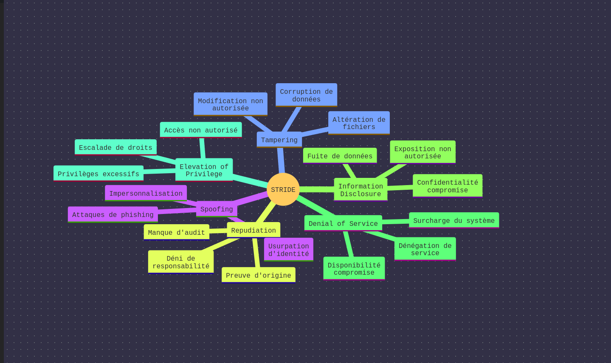
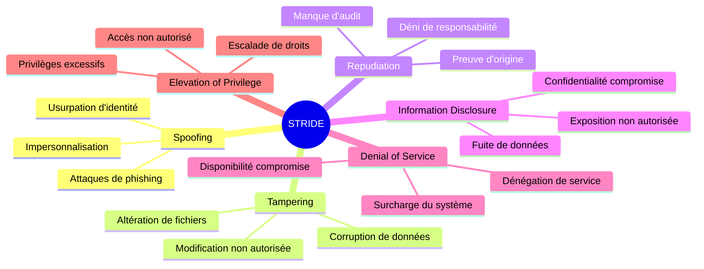

### **Threat Modeling for a YouTube-like Application**

---

### **1. Decompose the Application**

#### **1.1 Entry Points**
Entry points are interfaces through which potential attackers can interact with the application. Below is a table listing the entry points for the YouTube-like application:

| **Entry Point**               | **Description**                                                                 |
|-------------------------------|---------------------------------------------------------------------------------|
| **User Authentication**       | Login and registration forms for users.                                         |
| **Video Upload API**          | API endpoint for uploading videos.                                              |
| **Video Stream API**          | API endpoint for streaming videos.                                              |
| **Search API**                | API endpoint for searching and filtering videos.                                |
| **User Profile API**          | API endpoint for displaying user profiles and uploaded videos.                  |
| **Comment API**               | API endpoint for creating, displaying, and deleting comments.                   |
| **Video Deletion API**        | API endpoint for deleting videos.                                               |
| **View History API**          | API endpoint for displaying user view history.                                  |
| **Admin Dashboard**           | Interface for administrators to manage users, videos, and comments.             |

---

#### **1.2 Assets**
Assets are the resources or data that attackers might target. Below is a table listing the assets for the application:

| **Asset**                     | **Description**                                                                 |
|-------------------------------|---------------------------------------------------------------------------------|
| **User Credentials**          | Usernames, passwords, and authentication tokens.                                |
| **User Data**                 | Personal information (e.g., email, name, profile picture).                      |
| **User Upload History**       | List of videos uploaded by a user.                                              |
| **User View History**         | List of videos watched by a user.                                               |
| **Video Data**                | Metadata about videos (e.g., title, description, tags).                         |
| **Video Objects**             | Actual video files stored in the object store.                                  |
| **Comments**                  | User comments on videos.                                                        |
| **System Availability**       | Uptime and availability of the application.                                     |

---

#### **1.3 Trust Levels**
Trust levels define the access rights granted to external entities. Below is a table listing the trust levels:

| **Trust Level**               | **Description**                                                                 |
|-------------------------------|---------------------------------------------------------------------------------|
| **Public Users**              | Unauthenticated users who can view public videos and comments.                  |
| **Authenticated Users**       | Users who can upload videos, comment, and view private videos.                  |
| **Video Owners**              | Users who can delete or modify their own videos.                                |
| **Administrators**            | Users with full access to manage the system (e.g., delete videos, ban users).   |

---

#### **1.4 Data Flow Diagrams (DFDs)**
Below are three use cases with their corresponding DFDs:

---

##### **Use Case 1: Upload a Video**
1. **User** submits a video through the **Video Upload API**.
2. The video is sent to the **Video Uploading Server**.
3. The video is processed by the **Video Processing Queue**.
4. The processed video is stored in the **Video Object Store**.
5. Metadata about the video is saved in the **Database**.

---

##### **Use Case 2: Stream a Video**
1. **User** requests a video through the **Video Stream API**.
2. The **Application Server** retrieves the video metadata from the **Database**.
3. The **Application Server** fetches the video file from the **Video Object Store**.
4. The video is streamed to the **User**.

---

##### **Use Case 3: Search for Videos**
1. **User** submits a search query through the **Search API**.
2. The **Application Server** queries the **Database** for matching videos.
3. The **Application Server** returns the search results to the **User**.

---

### **2. Determine Threats**

#### **2.1 STRIDE Threat Categorization**
STRIDE is a model for identifying security threats:
- **S**poofing
- **T**ampering
- **R**epudiation
- **I**nformation Disclosure
- **D**enial of Service
- **E**levation of Privilege

-----------------------------

STRIDE est un framework de classification des menaces de sécurité qui aide à identifier et analyser les risques potentiels dans un système. Chaque lettre représente une catégorie de menace spécifique :

###  Spoofing (Usurpation d'identité)

- **Définition** : Simulation de l'identité d'un utilisateur légitime ou d'un système
- **Exemples** :
          - Attaques de phishing par email
  - Usurpation d'identifiant réseau (IP spoofing)
  - Impersonnalisation de sites web légitimes

- **Impact** : Permet aux attaquants d'accéder à des ressources protégées sans autorisation

###  Tampering (Modification non autorisée)

- **Définition** : Modification malveillante des données ou du système
- **Exemples** :
          - Modification de fichiers système
  - Altération de données en transit
  - Corruption de logs de sécurité

- **Impact** : Compromet l'intégrité des données et du système

###  Repudiation (Déni de responsabilité)

- **Définition** : Capacité pour un utilisateur de nier avoir effectué une action
- **Exemples** :
          - Absence de traçabilité des actions
  - Manque de preuves d'origine
  - Logs de sécurité incomplets

- **Impact** : Difficulté de prouver la responsabilité en cas d'incident

###  Information Disclosure (Fuite de données)

- **Définition** : Exposition non intentionnelle d'informations sensibles
- **Exemples** :
          - Fuites de données personnelles
  - Exposition de mots de passe
  - Accès non autorisé aux fichiers confidentiels

- **Impact** : Compromet la confidentialité des données

###  Denial of Service (Dénégation de service)

- **Définition** : Rendre un service indisponible ou difficile d'accès
- **Exemples** :
          - Attaques DDoS (Distributed Denial of Service)
  - Surcharge du système
  - Saturation des ressources

- **Impact** : Compromet la disponibilité du système

###  Elevation of Privilege (Escalade de privilèges)

- **Définition** : Acquisition de droits d'accès supérieurs à ceux autorisés
- **Exemples** :
          - Exploitation de vulnérabilités système
  - Utilisation de bugs pour obtenir des privilèges administrateur
  - Abus de permissions excessives

- **Impact** : Permet aux attaquants d'obtenir un accès non autorisé aux fonctionnalités système

Ce framework STRIDE est particulièrement utile car il permet d'identifier systématiquement les menaces potentielles dans un système et de prioriser les mesures de sécurité nécessaires pour les atténuer.

---

#### **2.2 Threats Summary Table**
Below is a summary of threats, vulnerabilities, scores, and countermeasures:

| **Asset**            | **Category**           | **Threat**                                                                 | **Vulnerability**                                                                 | **Score** | **Countermeasure**                                                                 |
|-----------------------|------------------------|----------------------------------------------------------------------------|-----------------------------------------------------------------------------------|-----------|------------------------------------------------------------------------------------|
| **User Credentials**  | Spoofing               | Attackers impersonate users by stealing credentials.                       | Weak password policies or plaintext password storage.                             | 8.5       | Enforce strong passwords, use multi-factor authentication (MFA), and hash passwords. |
| **Video Objects**     | Tampering              | Attackers modify or replace video files.                                   | Lack of integrity checks on video files.                                          | 7.2       | Use cryptographic hashes to verify file integrity.                                 |
| **User Data**         | Information Disclosure | Attackers access sensitive user data (e.g., email, profile picture).       | Insecure API endpoints or lack of encryption.                                     | 9.1       | Encrypt sensitive data in transit and at rest, and implement proper access controls. |
| **System Availability** | Denial of Service    | Attackers overload the system, making it unavailable.                      | Lack of rate limiting or DDoS protection.                                         | 8.8       | Implement rate limiting, use a Content Delivery Network (CDN), and deploy DDoS protection. |
| **Comments**          | Repudiation            | Users deny posting malicious comments.                                     | Lack of logging or auditing for comment actions.                                  | 6.5       | Implement logging and auditing for all comment actions.                            |
| **Admin Dashboard**   | Elevation of Privilege | Attackers gain admin access and control the system.                        | Weak authentication or authorization mechanisms for admin accounts.               | 9.3       | Use role-based access control (RBAC) and enforce strong authentication for admins. |

---

### **3. Report**

#### **3.1 Assumptions**
- The application uses HTTPS for secure communication.
- User passwords are hashed using bcrypt or a similar algorithm.
- The system runs in a cloud environment with built-in security features (e.g., AWS, GCP).
- Administrators have access to logs and monitoring tools.

---

#### **3.2 Clarifications**
- **Entry Points**: The entry points are based on the provided system components and features.
- **Assets**: The assets are derived from the system entities and their importance.
- **Trust Levels**: Trust levels are defined based on user roles and their access rights.
- **Threats**: The threats are identified using the STRIDE model and prioritized using CVSS scores.

---

#### **3.3 Recommendations**
- Implement strong authentication and authorization mechanisms.
- Encrypt sensitive data both in transit and at rest.
- Use logging and auditing to detect and respond to malicious activities.
- Regularly update and patch system components to address vulnerabilities.
- Conduct periodic security assessments and penetration testing.

---

### **Conclusion**
This threat modeling exercise identifies potential security risks in the YouTube-like application and provides actionable countermeasures to mitigate them. By following the OWASP Threat Modeling Process and using the STRIDE model, we ensure a structured and comprehensive approach to securing the application.